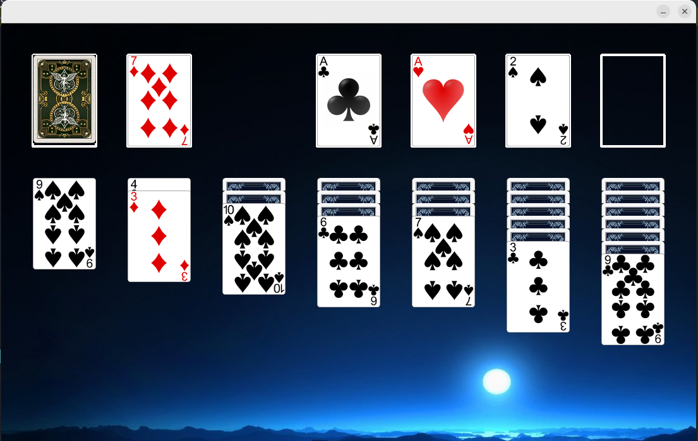

# Solitaire game

Welcome to a classic game of Solitaire built using Java Swing!
I developed it in 2015 at the university as an example of using MVC.

*   Customizable Settings: Tailor the game to your preferences with customizable settings, including card styles, backgrounds, and more.
* Drag-and-Drop Functionality: Easily move cards around the tableau with drag-and-drop functionality, making it simple to play and strategize.
* Rules Adherence: Stay true to the traditional rules of Solitaire for an authentic gameplay experience.